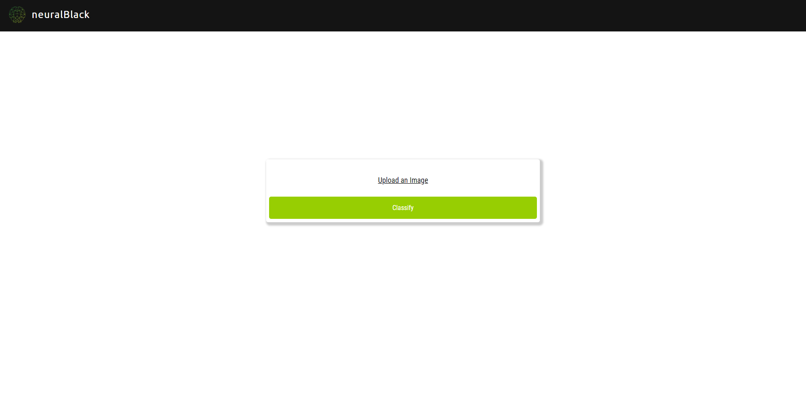
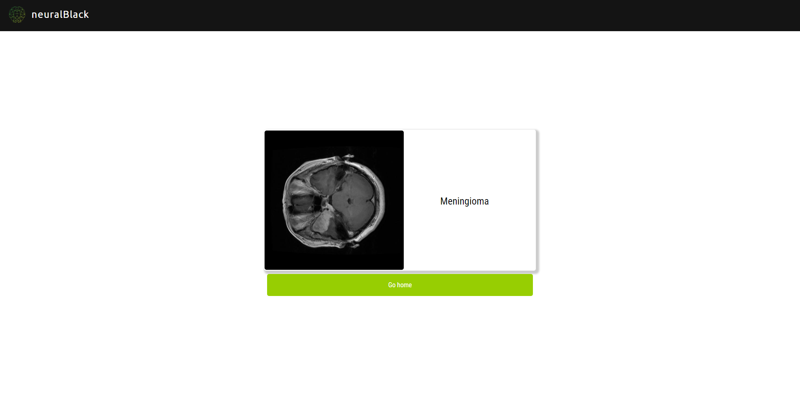
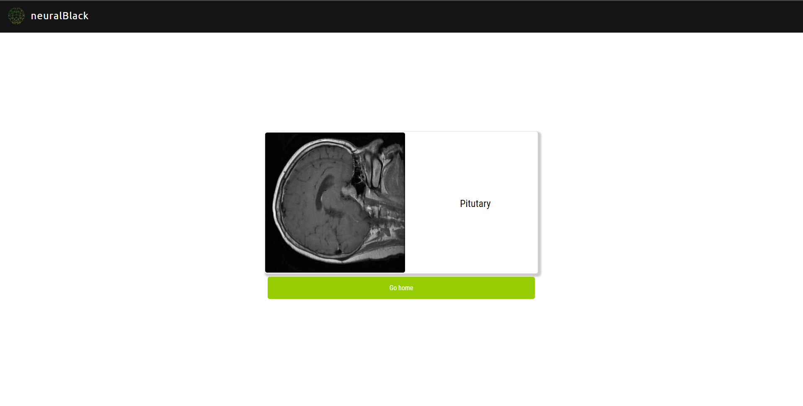

# neuralBlack

neuralBlack is a complete brain tumor detection, classification, and diagnosis system with high accuracy (99.3%) that uses state of the art Deep Learning methods.

## ResNet50 Neural Network Architecture

## Dataset

We have used [brain tumor dataset](https://figshare.com/articles/brain_tumor_dataset/1512427) posted by **Jun Cheng** on [figshare.com](figshare.com).

This brain tumor dataset containing 3064 T1-weighted contrast-inhanced images from 233 patients with three kinds of brain tumor: meningioma (708 slices), glioma (1426 slices), and pituitary tumor (930 slices).

## Modules

* [brain_tumor_dataset_preparation.ipynb](brain_tumor_dataset_preparation.ipynb) - An IPython notebook that contains preparation and preprocessing of dataset for training, validation and testing.

* [torch_brain_tumor_classifier.ipynb](torch_brain_tumor_classifier.ipynb) - An IPython notebook that contains all the steps, processes and results of training, validating and testing our brain tumor classifier.

* [test.py](test.py) - A python script which accepts path to an image as input, which then classifies the image into one of the three classes.

* [deploy.py](deploy.py) - A python script integrated with Flask server, that starts the Web Interface on local server where user can upload MRI image of brain and get classification results.

**Note:** We have included few images for testing under [test_images](test_images) directory.

## Running the classifier

Download the classifier model '.pt' file from this [drive link](https://drive.google.com/file/d/1-rIrzzqpsSg80QG175hjEPv9ilnSHmqK/view?usp=sharing) and place it under a folder named 'models' in the same directory where the files of this repository are present.

Before running the programs, kindly install the requirements as given in Requirements section of this README.

* Use the [test.py](test.py) script for running the script in Terminal, Powershell or Command Prompt.
  * `python test.py`

* Use [deploy.py](deploy.py) script to access the classifier as an interactive web interface.
  * `python deploy.py`

## Screenshots (Results & Web Interface)

### Web Interface

#### Home Page

#### Classification Results via Web Interface

### Classifier Evaluation

#### Loss Graph

#### Accuracy Graph

#### Confusion Matrix on Test set

## Requirements

Python 3 is required.

### Computational Specifications

Project done using Google Colab with follwing specifications:

* Ubuntu 18.04 64-bit OS
* 12 GB DDR4 RAM
* 16 GB NVidia Tesla P100 GPU
* 40 GB of Non-Persistent Storage

### Library Requirements

We'll be using the following libraries to complete our classification problem:

* **Numpy** - For linear algebra operations
* **Torch** - Pytorch Deep Learning Framework
* **OS** - To use Operating System methods
* **Random** - To set random seed at specific places where random operations take place just so it happens the same way everytime it is executed
* **Pandas** - To create DataFrame, CSV files, etc
* **Time** - To perform date time operations
* **Seaborn** - For sophisticated visualization
* **Pickle** - To save and load binary files of our training data
* **Scikit-Learn** - Machine learning framework. We have used this for evaluating our Classifier and for cross-validation split
* **Matplotlib** - To visualize images, losses and accuracy
* **Google Colab Drive** - To mount Google Drive so we can perform storage and loading operations using it (Only available on Google Colab)

The above mentioned libraries comes pre-installed and pre-configured with Google Colab.

Install the required libraries on your computer using the [pip](https://pip.pypa.io/en/stable/) package manager.

For pip version 19.1 or above:

~~~bash
pip install -r requirements.txt --user
~~~

or

~~~bash
pip3 install -r requirements.txt --user
~~~

#### Pytorch

Follow the steps for installation given in the official website of [Pytorch](https://pytorch.org).

## About

This project was done by Akshay Kumaar M. Paper is in progress. All the references papers have been included at the end of this repository's README.

## References

Thanks to [Vinoth Arjun](https://github.com/vinotharjun) for giving ideas for custom dataset class with different real-time augmentations.

## License

Copyright 2020 Akshay Kumaar M

Licensed under the Apache License, Version 2.0 (the "License");
you may not use this file except in compliance with the License.
You may obtain a copy of the License at

  http://www.apache.org/licenses/LICENSE-2.0

Unless required by applicable law or agreed to in writing, software
distributed under the License is distributed on an "AS IS" BASIS,
WITHOUT WARRANTIES OR CONDITIONS OF ANY KIND, either express or implied.
See the License for the specific language governing permissions and
limitations under the License.

### Research Papers

* [Multi-grade brain tumor classification using deep CNN with extensive data augmentation](https://www.sciencedirect.com/science/article/abs/pii/S1877750318307385)

* [A Deep Learning-Based Framework for Automatic Brain Tumors Classification Using Transfer Learning](https://link.springer.com/article/10.1007/s00034-019-01246-3)

* [Deep Residual Learning for Image Recognition (ResNet)](https://arxiv.org/pdf/1512.03385.pdf)

### Documentations

* [Pytorch](https://pytorch.org/docs/stable/index.html)

## Future Scopes

* Brain Tumor segmentation using GANs.
* Brain Tumor detection using Object Detection for localization of tumor in a given MRI image of the brain.
* Improve existing classification model and web interface
