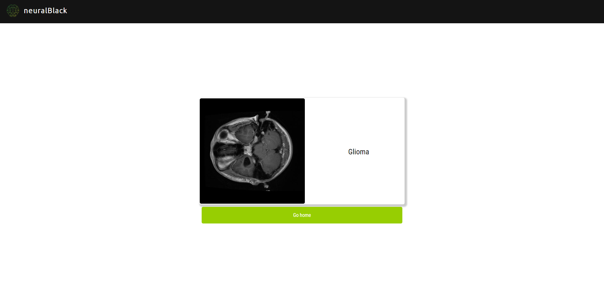
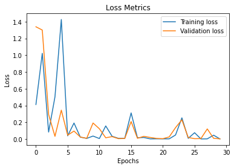
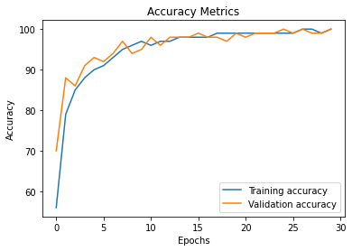

# Brain Tumor Classification

A Brain Tumor Classifier that can classify tumor into 3 classes: **Meningioma, Glioma, and Pitutary**, if present when given an MRI image of brain.

We have used fine-tuned ResNet50 Neural Network architecture with almost **99 % Accuracy** achieved by applying the method of Transfer Learning.

## Dataset

We have used [brain tumor dataset](https://figshare.com/articles/brain_tumor_dataset/1512427) posted by **Jun Cheng**.

This brain tumor dataset containing 3064 T1-weighted contrast-inhanced images from 233 patients with three kinds of brain tumor: meningioma (708 slices), glioma (1426 slices), and pituitary tumor (930 slices). 

## Modules

* [brain_tumor_dataset_preparation.ipynb](brain_tumor_dataset_preparation.ipynb) - An IPython notebook that contains preparation and preprocessing of dataset for training, validation and testing.

* [torch_brain_tumor_classifier.ipynb](torch_brain_tumor_classifier.ipynb) - An IPython notebook that contains all the steps, processes and results of training, validating and testing our brain tumor classifier.

* [test.py](test.py) - A python script which accepts path to an image as input, which then classifies the image into one of the three classes.

* [deploy.py](deploy.py) - A python script integrated with Flask server, that starts the Web Interface on local server where user can upload MRI image of brain and get classification results.

**Note:** We have included few images for testing under [test_images](test_images) directory.

## Running the classifier

Download the classifier model '.pt' file from this [drive link](https://drive.google.com/open?id=1-TOWpgVBayVS-rIrf3Z9R1dV5678zQeL) and place it under a folder named 'models' in the same directory where the files of this repository are present.

Before running the programs, kindly install the requirements as given in Requirements section of this README.

* Use the [test.py](test.py) script for running the script in Terminal, Powershell or Command Prompt.
    * `python test.py`

* Use [deploy.py](deploy.py) script to access the classifier as an interactive web interface.
    * `python deploy.py`

## Screenshots (Results & Web Interface)

### Web Interface

#### Home Page

#### Classification Results via Web Interface

### Classifier Evaluation

#### Loss Graph

#### Accuracy Graph

#### Confusion Matrix

## Requirements

Python 3 is required.

### Computational Specifications

Project done using Google Colab with follwing specifications:

* Ubuntu 18.04 64-bit OS
* 12 GB DDR4 RAM
* 8 GB NVidia Tesla K40 GPU
* 40 GB of Non-Persistent Storage

### Library Requirements

We'll be using the following libraries to complete our classification problem:

* **Numpy** - For linear algebra operations 
* **Torch** - Pytorch Deep Learning Framework
* **OS** - To use Operating System methods
* **Random** - To set random seed at specific places where random operations take place just so it happens the same way everytime it is executed
* **Pandas** - To create DataFrame, CSV files, etc
* **Time** - To perform date time operations
* **Seaborn** - For sophisticated visualization
* **Pickle** - To save and load binary files of our training data
* **Scikit-Learn** - Machien learning framework. We ahve used this for evaluating our Classifier and for cross-validation split
* **Matplotlib** - To visualize images, losses and accuracy
* **Google Colab Drive** - To mount Google Drive so we can perform storage and loading operations using it

Also the above mentioned libraries comes pre-installed and pre-configured with Google Colab.

#### Pytorch

Follow the steps for installation given in the official website of [Pytorch](https://pytorch.org).

#### Other Libraries

Install the required libraries using the pip package manager and requirements.txt file.

Install the required libraries using the [pip](https://pip.pypa.io/en/stable/) package manager.

For pip version 19.1 or above:

~~~bash
pip install -r requirements.txt --user
~~~

or

~~~bash
pip3 install -r requirements.txt --user
~~~

## About

This project was done by Akshay Kumaar M. Research Paper is in progress.

## References

### Research Papers

* [Multi-grade brain tumor classification using deep CNN with extensive data augmentation](https://www.sciencedirect.com/science/article/abs/pii/S1877750318307385)

* [A Deep Learning-Based Framework for Automatic Brain Tumors Classification Using Transfer Learning](https://link.springer.com/article/10.1007/s00034-019-01246-3)

### Documentations

* [Pytorch](https://pytorch.org/docs/stable/index.html)